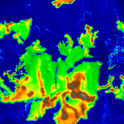

# World generation and various algorithms

This application is used to generate images from different algorithms. It was created to explore different algorithms
for generating worlds, but at the moment only the Platec algorithm is implemented.

## Algorithms

### [Platec](/readme/Viitanen_Lauri_2012_03_30.pdf)

Platec is a simulation of tectonic plates and collisions in order to create a realistic heightmap.
It was created and documented in the thesis Physically Based Terrain Generation Procedural Heightmap Generation Using
Plate Tectonics by Lauri Viitanen at the University of Helsinki, Finland.
His work has been uploaded at this [link](https://sourceforge.net/projects/platec/) and has been modified/integrated
into this project.

#### How It Works

The simulation starts with an initial heightmap with some landmasses on it. This heightmap is
created from the diamond square algorithm. Then tectonic plates are created randomly with the
Voronoi random algorithm.
The plates have random movements and will go to make collisions. The collisions are differentiated by “continent on
continent”, “ocean and others”. This allows simulating subductions and folds of continental collisions. A simple erosion
function is implemented to smooth the terrain. After a while the plates will become slow and few collisions will occur,
so we change the cycle and restart the random plate generation.

For more details you can read the [thesis](/readme/Viitanen_Lauri_2012_03_30.pdf) and view the code in
/src/algos/platec/

#### Options

- **Size of image**
- **Seed**
- **Number of tectonic plates**
- **Max number of iterations**
- **Max number of Cycles**
- **Start map roughness** Allows to create more or less smooth coasts in the initial continents and more islands
- **Percent of sea at the start** Raise the initial ocean level
- **Period to erode the plates**Increase the interval to perform more erosion on the continents
- **The ratio of folding of continental collision** Allows you to create higher mountains and peaks
- **Value of plate superposition to merge** Represents at what absolute value of overlap of two plates should the continents be
  combined and collide? A value too small and the continental plates will hardly overlap and create only thin mountains.
- **Percent of plate superposition to merge** Similar to the one above, but from the percentage of overlap
  of the smallest plate

#### Various defects and comments

- Landmasses can sometimes pass through each other because of the values for the overlapping
  determined in the parameters.
- The algorithm does not use multithreading and has been built in such a way as to make it difficult to integrate
  multithreading.
- At each iteration, we have to recalculate all the segments that allow us to determine the size of the continental zone
  in the collision.
  If we can allow modifying the segments between iterations without having any problems, we could gain a lot in
  performance.
- It would be very difficult to run the simulation on a sphere.

### [Noise Perlin](https://adrianb.io/2014/08/09/perlinnoise.html)

Perlin noise is a pseudo-random generation that can create a more “real” noise by being smoother than a
100% random noise. Credit to Ken Perlin for developing this algorithm.

#### Options

- **Size of image**
- **Seed**
- **Size of bigger cell** to indicate the pixel distribution of points in the image. Increasing it
  to zoom in on the image.
- **[Octaves](https://adrianb.io/2014/08/09/perlinnoise.html#working-with-octaves)** increase image sharpness by
  generating the set number of Perlin noises at different frequencies and amplitudes
- **Persistence** defines the lingering of the original amplitude in octaves

### Random Voronoi

The Voronoi diagram divides the space of a plane according to the shortest distance from several starting points. This
randomized version gives a similar result, but is different in the generation and gives semi-random boundaries. At each
generation iteration, the points choose an adjacent random point and add it to their shape.

#### Options

- **Size of image**
- **Seed**
- **Number of points** at the start of the generation

### [Diamond Square](https://en.wikipedia.org/wiki/Diamond-square_algorithm)

The diamond square algorithm generates a random noise image from 4 values in the corners of the image. It creates the
values in a odd movement as in this image:

This algorithm makes it easy to create fractal images as if we zoomed into the image and increased the details. This
advantage limits the size of the image to a square shape with a side respecting 2n+1 like 257, 513,
etc.

#### Options

- **Size of image**
- **Seed**
- **Image roughness** increases the roughness of the image

