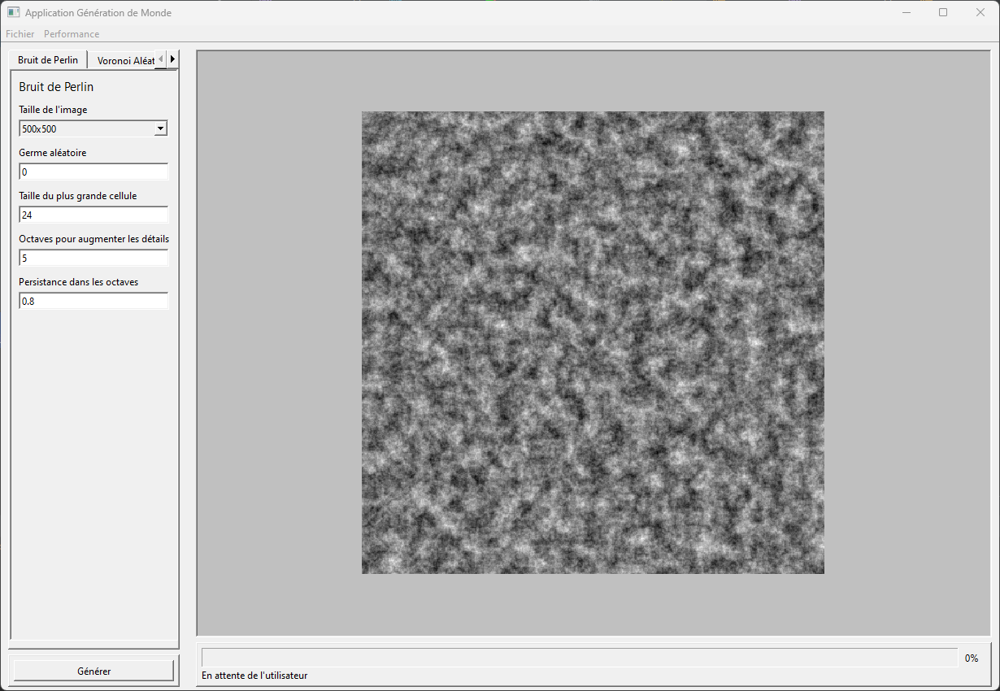

# World Generation

Cette application permet de générer des images à partir de différents algorithmes. En ce moment seulement l'algorithme de Perlin a été implémenté. Plus tard je souhaite ajouter de quoi pour générer un monde avec biome.

## Algorithme

### [Bruit de Perlin](https://adrianb.io/2014/08/09/perlinnoise.html)

Le bruit de Perlin est une génération pseudo aléatoire pouvant créer un bruit plus "réel" en étant plus lisse qu'un bruit 100% aléatoire. Honneur à Ken Perlin pour avoir développé cet algorithme.

#### Options

- **Taille de l'image**
- **Germe aléatoire** ou "random seed"
- **Taille de la plus grande cellule** pour indiquer la répartition en pixel des points dans l'image. L'agrandir permet comme de zoomer sur l'image
- **[Octaves](https://adrianb.io/2014/08/09/perlinnoise.html#working-with-octaves)** permet d'augmenter la netteté de l'image en générant le nombre défini de bruit Perlin à différente fréquence et amplitude
- **Persistance** permet de définir la persistance de l'amplitude de base dans les octaves

