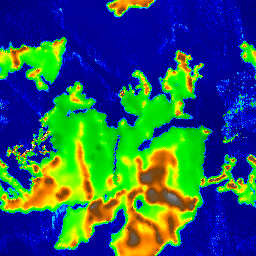

# Génération de monde et différents algorithmes

Cette application permet de générer des images à partir de différents algorithmes.
Elle a été créer dans le but d'explorer différents algorithmes dans le but de générer des mondes, mais en ce moment
seulement l'algorithme de Platec est implémenté.

## Algorithmes

### [Platec](Viitanen_Lauri_2012_03_30.pdf)

Platec est une simulation de plaques tectoniques et collisions dans le but de créer un "heightmap" dite réaliste.
Elle a été créée et documentée dans la thèse Physically Based Terrain Generation Procedural Heightmap Generation Using
Plate Tectonics de Lauri Viitanen à l'Université de Helsinki, Finlande.
Son travail a été téléchargé à ce [lien](https://sourceforge.net/projects/platec/) et a été modifé/intégré dans ce
projet.

#### Fonctionnement

La simulation commence avec un "heightmap" map de départ avec quelques masses continentales dessus. Ce "heightmap" est
créé à partir du diamond square algorithme. Ensuite des plaques tectoniques sont créées aléatoirement avec l'algorithme
de Voronoi aléatoire.
Les plaques ont des mouvements aléatoires et vont partir faire des collisions. Les collisions sont différenciées par
continent sur continent, océan et autres. Cela permet de simuler les subductions et les plies des collisions
continentales. Une simple fonction d'érosion est implémenté pour lisser le terrain. Après un certain temps les plaques
vont devenir lentes et peu de collisions vont se produire alors on change de cycle et relance la génération de plaque
aléatoire.

Pour plus de détails vous pouvez lire la [thèse](Viitanen_Lauri_2012_03_30.pdf) et regarder le code dans
/src/algos/platec/

#### Options

- **Taille de l'image**
- **Germe aléatoire** ou "random seed"
- **Nombre de plaques tectoniques**
- **Nombre max d'itération**
- **Nombre max de cycle**
- **Rugosité de la map initial** Permet de créer des côtes plus ou moins lisses dans les continents initiaux et plus
  d'îles
- **Pourcentage d'océan dans la map initial** Augmenter le niveau de l'océan initial
- **Période pour l'érosion des plaques**Augmenter l'intervalle pour effectuer plus d'érosion sur les continents
- **Ratio de pli des collisions continentales** Permet de créer des montagnes plus hautes et à-pics
- **Valeur de superposition pour combiner les plaques** À partir de quelle valeur absolue de superposition de deux
  plaques
  doit-on combiner les continents et effectuer la collision ? Une valeur trop petite et les plaques continentales
  vont peu se superposer et créer seulement de minces montagnes
- **Pourcent de superposition pour combiner les plaques** Semblable à celui au-dessus, mais à partir du pourcentage de
  superposition de la plus petite plaque

#### Différents défauts et commentaires

- Des masses continentales peuvent parfois passer l'un à travers l'autre à cause des valeurs pour la superposition
  déterminer dans les paramètres.
- L'algorithme n'utilise pas de multi-thread et a été construit de manière à rendre difficile l'intégration du
  multi-thread.
- À chaque itération, on doit recalculer tous les segments qui permettent determiner la taille de la zone continentale
  dans la collision.
  Si on peut permettre de modifier les segments entre les itérations sans avoir de problèmes on pourrait gagner beaucoup
  en performance.
- Ce serait très difficile d'effectuer la simulation sur une sphère.

### [Bruit de Perlin](https://adrianb.io/2014/08/09/perlinnoise.html)

Le bruit de Perlin est une génération pseudo aléatoire pouvant créer un bruit plus "réel" en étant plus lisse qu'un
bruit 100% aléatoire. Honneur à Ken Perlin pour avoir développé cet algorithme.

#### Options

- **Taille de l'image**
- **Germe aléatoire** ou "random seed"
- **Taille de la plus grande cellule** pour indiquer la répartition en pixel des points dans l'image. L'agrandir permet
  comme de zoomer sur l'image
- **[Octaves](https://adrianb.io/2014/08/09/perlinnoise.html#working-with-octaves)** permet d'augmenter la netteté de l'
  image en générant le nombre défini de bruits Perlin à différente fréquence et amplitude
- **Persistance** permet de définir la persistance de l'amplitude de base dans les octaves

### Voronoi aléatoire

Le diagramme de Voronoi divise l'espace d'un plan selon la plus courte distance selon plusieurs points de départ. Cette
version aléatoire donne un résultat semblable, mais est différent dans la génération et donne des frontières
semi-aléatoire. À chaque itération de génération, les points choisissent un point aléatoire adjacent et l'ajoute à leur
forme.

#### Options

- **Taille de l'image**
- **Germe aléatoire** ou "random seed"
- **Nombre de points** au départ de la génération

### [Diamond Square](https://en.wikipedia.org/wiki/Diamond-square_algorithm)

L'algorithme du diamond square permet de générer une image de bruit aléatoire à partir de 4 valeurs dans les coins de l'
image. Elle crée les valeurs dans un mouvement spécial comme sur cette image :

Cet algorithme permet de créer facilement des images fractales comme si on agrandissait l'image et augmentait les
détails. Cet avantage bloque la taille de l'image dans une forme carrée avec un côté respectant 2n+1 comme 257, 513,
etc.

#### Options

- **Taille de l'image**
- **Germe aléatoire** ou "random seed"
- **Rugosité de l'image** permet d'augmenter la netteté de l'image

